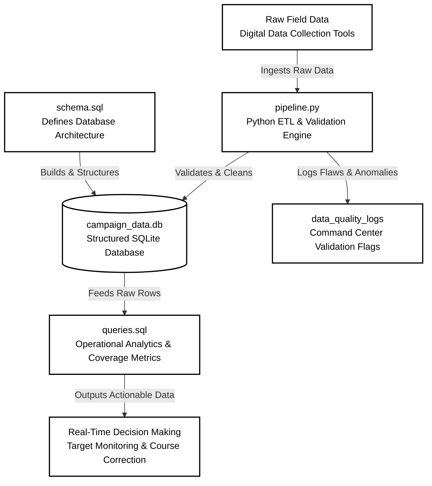

# malaria-campaign-analytics
# Automated Data Pipeline & Performance Dashboard for Integrated Campaigns

This repository showcases an end-to-end data pipeline design built specifically to solve data reconciliation delays and field synchronization errors during large-scale digitized public health initiatives (such as SMC and ITN integrations).

## Features
* Relational Database Design: A structured schema to track real-time field data alongside macro campaign operational targets.
* Automated ETL Pipeline: A programmatic Python validation script that checks incoming records against standard operational rules (e.g., child age guidelines and invalid GPS coordinate ranges).
* Command Center Analytics: Embedded SQL scripts to measure target execution metrics, track coverage rates, and clean erroneous entries.
* Technical Documentation: Fully integrated Product Requirements Document (PRD) frameworks and field deployment Job Aids.

## Technical Stack
* **Language:** Python 3.x (Pandas, SQLite3)
* **Database Engine:** SQL (SQLite / PostgreSQL environment compatible)
* **Documentation Standards:** Markdown Product Architecture Specification

To clone this project,

bash

git clone [https://github.com/teslim-ogundele/malaria-campaign-analytics.git]
